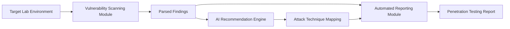

# AI-Powered Penetration Testing Assist System

AI-based vulnerability analysis, attack recommendation, and automated reporting framework.

> ⚠️ Copyright Notice
>
> This repository contains an MSc Cyber Security dissertation project developed by Chirag Menariya.
>
> All rights are reserved. The source code, documentation, diagrams, and associated materials may not be copied, modified, distributed, or used without explicit written permission from the author.
>
> This repository is made available solely for academic assessment and portfolio demonstration purposes.

## Project Overview

Penetration testing is a vital cybersecurity behaviour that helps us identify potential security vulnerabilities in systems, networks, web applications and APIs before attackers can exploit those vulnerabilities (OWASP Foundation, 2026; OWASP Foundation, 2025). Yet, penetration testing is still mostly a lot of manual work; including information gathering, vulnerability analysis, attack method selection and reporting (Abu-Dabaseh and Alshammari, 2018). With the increase in cyber threats, we need tools that can maximize the penetration tester efficiency (Hassan, 2024; NIST, 2026).

The ability to analyse large amounts of data and identify useful patterns has led artificial intelligence (AI) to become one of most significant technologies in the cybersecurity space. There are well-defined penetration testing frameworks such as the Penetration Testing Execution Standard (PTES) that can guide a security assessment through a structured process and vulnerability scanners that may help you to pinpoint vulnerabilities on a given target (OWASP Foundation, 2026; MITRE, 2026). But they were never designed to guide a tester in real-time on what actions to perform next after a vulnerability is detected. This yields that testers will work most the time with blind eyes and to make decisions based on what they think (Bugingo, 2026).

This is difficult for junior penetration testers and cybersecurity students who may understand the scan reports but are not sure which attack techniques are the most applicable, or even effective (Hassan, 2024). Thus, there exists a requirement to fill the void between discovering vulnerabilities and determining subsequent actions within a pen test.

The objective of this project is to use Artificial Intelligence to implement Penetration Testing Assist system by integrating the scan for vulnerabilities, attack recommendations and generation of reports automatically. The system will evaluate vulnerabilities identified and appropriate penetration testing methodologies in a legal and controlled manner, then write structured security reports autonomously. This way you achieve efficiency, a learning aid, and support for penetration testers to make decisions better during the pen test phase (Andy, 2026; MITRE, 2026).

## Academic Context

- Student Name: Chirag Menariya
- Student ID: 24155368
- Module: 7COM1039-0509-2025 Advanced Computer Science Masters Project

## Literature Review

Many frameworks and methodologies have been created to aid penetration testing tasks. The Penetration Testing Execution Standard (PTES) gives a step-by-step approach to penetration testing from phases like intelligence gathering, vulnerability analysis, exploitation and reporting. Just as the OWASP Web Security Testing Guide (OWASP 2026) provides a full-fledged guide to the testing of web security. In addition, the OWASP Top 10 also describes the top ten security risks facing web applications and is often used as a measure of whether vulnerabilities may exist during an assessment (OWASP Foundation, 2025). These frameworks are helpful in defining the testing process, but they contain primarily methodologies and common vulnerabilities, lacking an intelligent decision support during penetration tests.

Industry also widely adopts cybersecurity frameworks like the MITRE ATT&CK Framework and NIST Cybersecurity Framework. The MITRE ATT&CK knowledge base provides information about high-level adversary behaviour and their attack patterns to support the work of security professionals (MITRE, 2026). Similarly, NIST Cybersecurity Framework gives organisations a guide to manage cyber security risk (NIST, 2026). These frameworks work well as cornerstones of threat modelling and security organizational approaches but treat these items as swimming in the realm of abstraction; they do not give any real time recommendations on what actions a pen tester should take next during an assessment.

Over the years many automated security tools have been created to help penetration testers. Again, the third category of tools are based on network scanning, service enumeration and identifying vulnerability like nmap and Burp Suite and OWASP ZAP. The study of Abu-Dabaseh and Alshammari shows how the process of vulnerability discovery can be fundamentally automated with reducing time and labour effort (Abu-Dabaseh and Alshammari, 2018). Now, nearly all other tools stop at detecting vulnerabilities and still need an expert tester to find attack paths, exploit techniques, and reporting.

Use of artificial Intelligence (AI) and its future in Solving Company Issues Artificial Intelligence has been one of the recent significant topics researched by scholars dealing with Cybersecurity. Various applications regarding the use of AI were noted during penetration tests by Hassan: vulnerability analysis, pattern recognition and security decision support. The research noted that AI has the potential to be more efficient and help security professionals as they sift through massive amounts of security data (Hassan, 2024).

Also, recent work by Andy which showed how AI models could be used to facilitate offensive security efforts, through vulnerability analysis and support with certain testing tasks (Andy, 2026). Likewise, Bugingo highlighted the increasing relevance of advanced penetration testing methods in discovering multifaceted vulnerabilities and enhancing cyber resilience (Bugingo, 2026). The aforementioned research suggests that AI can refresh penetration testing in a way that is much more versatile than traditional automation.

Overall, the literature indicates that current penetration testing frameworks, vulnerability scanners and cybersecurity methodologies are effective at identifying vulnerabilities and supporting security assessments. However, they provide limited assistance in recommending the next actions a tester should perform after vulnerabilities are discovered. This gap is particularly challenging for junior penetration testers and cybersecurity students. Therefore, there is a need for an intelligent system that combines vulnerability identification, attack recommendation and automated reporting to support penetration testing activities in a controlled and ethical environment.

## Aim

To design and develop an AI-powered Penetration Testing Assist System that assists security professionals in vulnerability identification, attack recommendation, and automated penetration testing report generation.

## Objectives

- To develop a vulnerability scanning module capable of identifying common security weaknesses in web applications and network services. 
- To design an AI-based recommendation engine that suggests appropriate attack techniques based on discovered vulnerabilities. 
- To generate automated penetration testing reports containing findings, risk ratings, evidence, and remediation recommendations. 
- To evaluate the effectiveness and accuracy of the system in supporting penetration testing activities. 

## Research Questions

- How can Artificial Intelligence assist penetration testers during vulnerability assessment and exploitation planning? 
- Can AI-generated attack recommendations improve penetration testing efficiency? 
- How effective is automated report generation compared to traditional manual reporting methods? 

## Planned System Components

### 1. Vulnerability Scanning Module

This module will support network and web application scanning activities in a controlled lab environment. It is expected to help identify:

- Open ports
- Running services
- Common web application vulnerabilities
- Known CVEs where applicable
- Security weaknesses discovered by tools such as Nmap, OWASP ZAP, or Burp Suite

### 2. AI Attack Recommendation Engine

The recommendation engine will analyse discovered vulnerabilities and suggest suitable penetration testing approaches. Recommendations may be mapped to recognised frameworks such as:

- MITRE ATT&CK
- OWASP Top 10
- OWASP Web Security Testing Guide
- CVE databases

The purpose of this module is to assist decision-making, especially for junior penetration testers and cybersecurity students who may understand scan results but need support deciding what action should be taken next.

### 3. Automated Reporting Module

The reporting module will generate professional penetration testing reports that may include:

- Executive summary
- Technical findings
- Risk ratings
- Evidence and screenshots
- Recommended remediation steps
- References to relevant attack techniques or security standards

## Proposed Architecture

## Methodology

This project will adopt a design and experimental research methodology. The proposed system will be developed within a controlled penetration testing environment using intentionally vulnerable systems such as DVWA, OWASP Juice Shop, Metasploitable, and vulnerable APIs.
The framework will consist of three major components:

1.	Vulnerability Scanning Module 
- Network and web application scanning. 
- Identification of open ports, services, and common vulnerabilities. 

2.	AI Attack Recommendation Engine 
- Analysis of identified vulnerabilities. 
- Mapping findings to MITRE ATT&CK and OWASP attack techniques. 
- Generation of recommended penetration testing approaches. 

3.	Automated Reporting Module 
- Risk classification. 
- Evidence collection. 
- Remediation suggestions. 
- Professional penetration testing report generation. 
Testing will be conducted against multiple vulnerable targets, and results will be evaluated based on detection accuracy, recommendation quality, and reporting effectiveness. 

## Tools and Technologies

The proposed project may use the following tools and technologies:

- Python
- JavaScript
- VS Code
- Nmap
- OWASP ZAP
- Burp Suite
- OpenAI API or local LLM
- CVE database
- MITRE ATT&CK Framework
- Docker
- Kali Linux

## Expected Outcomes

The project is expected to produce an intelligent penetration testing assistance platform capable of:

- Detecting common vulnerabilities. 
- Providing AI-generated attack recommendations. 
- Mapping findings to known attack techniques. 
- Generating professional penetration testing reports automatically. 
- Reducing the time required for penetration testing documentation. 

The system is expected to improve penetration testing efficiency while providing educational value for junior security professionals and cybersecurity students.

## Ethical and Legal Use

This project is intended strictly for authorised penetration testing, academic research, and controlled lab environments. It must only be used against systems where explicit permission has been granted.

Do not use this system against public, third-party, or unauthorised targets. All testing should follow ethical hacking principles, institutional policies, and applicable laws.

## Project Plan

## References

- Abu-Dabaseh, F. and Alshammari, E. (2018) Automated Penetration Testing: An Overview, CS & IT Conference Proceedings. Available at: [https://www.csitcp.org/abstract/8/](https://www.csitcp.org/abstract/8/).
- Andy, D. (2026) SANS: Workshop: Offensive AI In Practice: Hands on Exploitation of Vulnerable Applications Using Open-Source AI Tools, GitHub. Available at: [https://github.com/rpigu-i/sans-offensive-ai-in-practice-april-2026](https://github.com/rpigu-i/sans-offensive-ai-in-practice-april-2026).
- Bugingo, E. (2026) “The Role of Advanced Penetration Testing Techniques in Enhancing   Cybersecurity: A Survey on Web Application Security”, JUTI: Jurnal Ilmiah Teknologi Informasi, 24(1), pp. 87–118. Available at: [https://doi.org/10.12962/j24068535.v24i1.a1372](https://doi.org/10.12962/j24068535.v24i1.a1372).
- Hassan, R. (2024) Systematic Literature Review of Challenges and AI Contributions in Penetration Testing, Digitala Vetenskapliga Arkivet. Available at: [https://www.diva-portal.org/smash/record.jsf?dswid=-4925&pid=diva2%3A1895349&c=13&searchType=SIMPLE&language=en&query=Artificial+Intelligence+in+Penetration+Testing&af=%5B%5D&aq=%5B%5B%5D%5D&aq2=%5B%5B%5D%5D&aqe=%5B%5D&noOfRows=50&sortOrder=author_sort_asc&sortOrder2=title_sort_asc&onlyFullText=false&sf=all](https://www.diva-portal.org/smash/record.jsf?dswid=-4925&pid=diva2%3A1895349&c=13&searchType=SIMPLE&language=en&query=Artificial+Intelligence+in+Penetration+Testing&af=%5B%5D&aq=%5B%5B%5D%5D&aq2=%5B%5B%5D%5D&aqe=%5B%5D&noOfRows=50&sortOrder=author_sort_asc&sortOrder2=title_sort_asc&onlyFullText=false&sf=all).
- MITRE (2026) MITRE ATT&CK®, attack.mitre.org. Available at: [https://attack.mitre.org/](https://attack.mitre.org/).
- NIST (2026) Cybersecurity Framework, nist.gov. Available at: [https://www.nist.gov/cyberframework](https://www.nist.gov/cyberframework).
- OWASP Foundation (2025) OWASP Top Ten Web Application Security Risks | OWASP Foundation, OWASP. Available at: [https://owasp.org/www-project-top-ten/](https://owasp.org/www-project-top-ten/).
- OWASP Foundation (2026) OWASP Web Security Testing Guide | OWASP Foundation, OWASP. Available at: [https://owasp.org/www-project-web-security-testing-guide/](https://owasp.org/www-project-web-security-testing-guide/).
